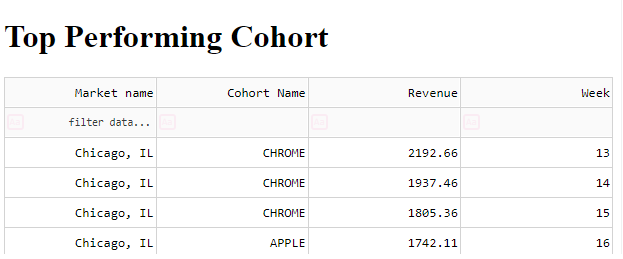

# SpotHero Data Engineering Take Home Case Study

## Spark Analysis

>Please find the attached notebook containing the analysis for the given case studay

### Instructions to run docker container


Build the container

```console
docker build -t spotherocasestudy:1.0 .
```

Run the container

```console
docker run -p 8050:8050 spotherocasestudy:1.0 
```
#

Head to [localhost:8050](http://localhost:8050) to view the web app

### Dash app screenshot
   
# 


